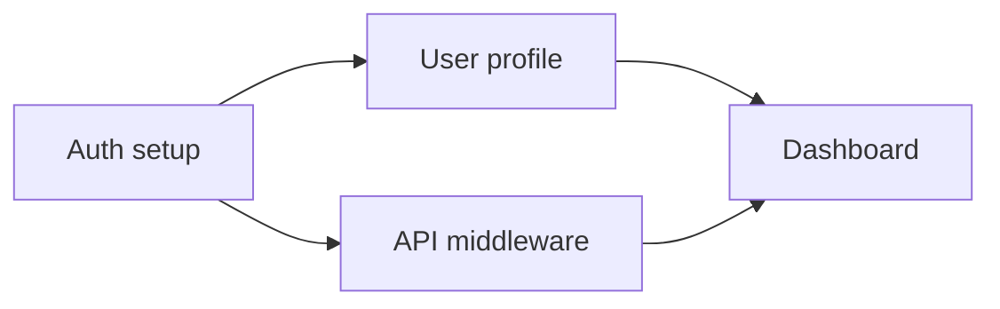
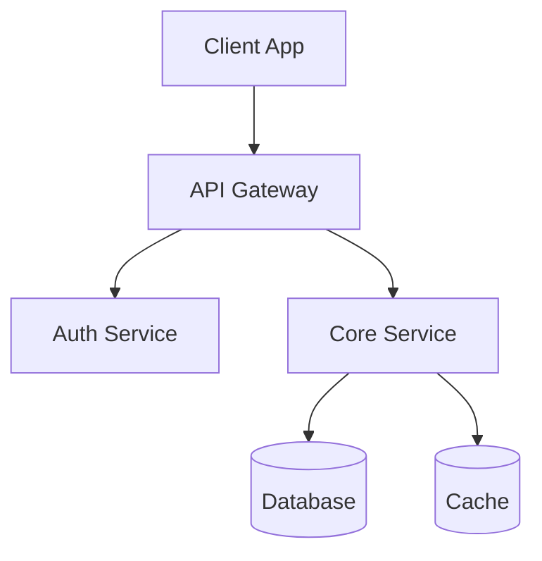

# Dev Handoff Guide — Converge

> This guide is used **only in Deep complexity tier**, after the convergence summary is confirmed and all 5 output files are generated. It provides templates for translating a Converge output into actionable engineering artifacts.

## When to Trigger

1. Complexity tier is **Deep**
2. All 5 output files (`01-context.md` through `05-discovery.md`) are generated
3. User confirms the convergence summary
4. PM asks: _"Want me to generate the dev handoff?"_ — or auto-generates if user previously opted in

If the user declines, stop. The 5 output files are the final deliverable.

---

## Task Breakdown

Break `03-execution.md` into discrete, assignable tasks.

```markdown
### Task: [Name]
- **Priority**: P0 / P1 / P2
- **Depends on**: [Other task names, or "None"]
- **Acceptance Criteria**:
  - [ ] [Criterion 1]
  - [ ] [Criterion 2]
- **Estimated effort**: S / M / L / XL
- **Notes**: [Context, gotchas, related decisions from discovery]
```

> Sizing guide: S = < 1 day, M = 1–3 days, L = 3–5 days, XL = 5+ days (consider splitting).

### Dependency Graph

When tasks have dependencies, generate a Mermaid graph:



---

## Tech Spec

### Technology Stack

| Layer | Choice | Reasoning |
|-------|--------|-----------|
| Frontend | [e.g., Next.js 14] | [Why this over alternatives] |
| Backend | [e.g., FastAPI] | [Why this over alternatives] |
| Database | [e.g., PostgreSQL] | [Why this over alternatives] |
| Infra | [e.g., Vercel + Supabase] | [Why this over alternatives] |

### Architecture Diagram



### Data Model

Define key entities and their relationships:

```markdown
#### [Entity Name]
| Field | Type | Constraints | Description |
|-------|------|-------------|-------------|
| id | UUID | PK | [Description] |
| [field] | [type] | [constraints] | [Description] |

**Relationships**:
- has_many: [Other entity]
- belongs_to: [Other entity]
```

### Key Technical Decisions

| Decision | Choice | Alternatives Considered | Rationale |
|----------|--------|------------------------|-----------|
| [e.g., Auth strategy] | [e.g., JWT + refresh tokens] | [e.g., Session-based, OAuth only] | [Why] |

---

## API Contracts

Define contracts for each endpoint:

```markdown
### [Endpoint Name]
- **Method**: GET / POST / PUT / DELETE
- **Path**: `/api/v1/[resource]`
- **Auth**: [Required / Public / Admin-only]
- **Request**:
  ```json
  {
    "field": "type — description"
  }
  ```
- **Response** (200):
  ```json
  {
    "field": "type — description"
  }
  ```
- **Error Codes**:
  | Code | Meaning | When |
  |------|---------|------|
  | 400 | Bad Request | [Condition] |
  | 401 | Unauthorized | [Condition] |
  | 404 | Not Found | [Condition] |
- **Notes**: [Rate limits, pagination, caching, side effects]
```

---

## Change Tracking

When the plan is updated after initial generation, produce a change report:

### Diff Summary
```markdown
#### Changed: [Section / Component]
- **Before**: [Previous state]
- **After**: [New state]
- **Reason**: [Why it changed]
```

### Impact Analysis
```markdown
#### Affected Tasks
| Task | Impact | Action Required |
|------|--------|-----------------|
| [Task name] | [What changed for this task] | [Rewrite / Adjust scope / No change] |
```

### Effort Delta
```markdown
#### Timeline Impact
- **Original estimate**: [X days/weeks]
- **Revised estimate**: [Y days/weeks]
- **Delta**: [+/- Z]
- **Critical path affected**: [Yes/No — explain]
```
