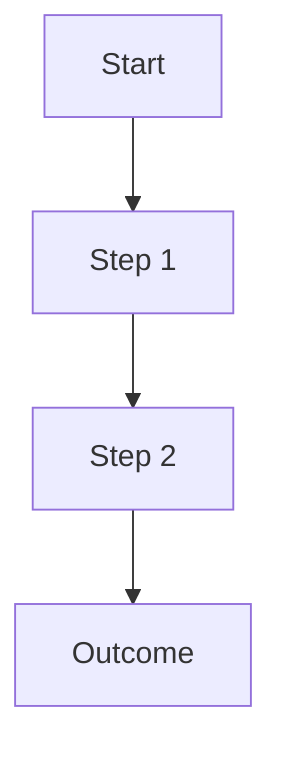

# Output Template — Converge

> Each section below is a **separate file**. Create each as an independent `.md` file inside `project-docs/`. Do NOT combine them into one file.
>
> Replace all `[...]` placeholders with real content from the discovery session. Remove instruction blocks (`>`) before finalizing.

---

## 01-context.md

```markdown
# [Title]

## Background
[Context: what exists today, why this matters]

## Problem
[Specific problem or question being addressed]

## Value
[Why solving this matters — for whom, what changes]

## Direction
[High-level direction or hypothesis]

<!-- Round X, Y -->
```

---

## 02-solution.md

```markdown
# Solution

## Approach
[Core approach / method / strategy]

## Flow
[Step-by-step flow or process — use Mermaid diagrams where appropriate]



## Key Components

### Component 1: [Name]
- **Description**: [What it does]
- **Happy Path**: [Normal behavior]
- **Edge Cases**: [Unusual situations]
- **Error Handling**: [Failure modes and recovery]

### Component 2: [Name]
- **Description**: [What it does]
- **Happy Path**: [Normal behavior]
- **Edge Cases**: [Unusual situations]
- **Error Handling**: [Failure modes and recovery]

## Phasing (if applicable)

### Phase 1 — [Theme]
[What's delivered, why this order]

### Phase 2 — [Theme]
[What's delivered, dependencies on Phase 1]

<!-- Round X, Y -->
```

---

## 03-execution.md

```markdown
# Execution Plan

## Task Breakdown

### Task: [Name]
- **Priority**: P0 / P1 / P2
- **Depends on**: [Other tasks or "None"]
- **Acceptance Criteria**:
  - [ ] [Criterion 1]
  - [ ] [Criterion 2]
- **Estimated effort**: S / M / L / XL

### Task: [Name]
...

## Technical Approach (if applicable)
[Tech stack, architecture, data model — keep brief here; detail goes in dev handoff]

## Timeline / Sequence
[Delivery order, milestones, critical path]

## Resource Requirements
[What's needed: people, tools, budget, data]

<!-- Round X, Y -->
```

---

## 04-risks.md

```markdown
# Risks & Assumptions

## Confirmed Assumptions
| # | Assumption | Source | Status |
|---|-----------|--------|--------|
| 1 | [Text] | Round X | ✅ Confirmed |

## Unconfirmed Assumptions (⚠️)
| # | Assumption | Source | Risk Level | Validation Plan |
|---|-----------|--------|------------|-----------------|
| 1 | [Text] | Round X | High/Med/Low | [How to validate] |

## Risk Items
| # | Risk | Probability | Impact | Mitigation |
|---|------|------------|--------|------------|
| 1 | [Description] | H/M/L | H/M/L | [Plan] |

## TBD Items
| # | Item | Depends On | Target Date |
|---|------|-----------|-------------|
| 1 | [What needs deciding] | [Blocker] | [When] |

<!-- Round X, Y -->
```

---

## 05-discovery.md

```markdown
# Discovery Log

## Session Info
- **Topic**: [Name]
- **Type**: Product / Research / Decision / Other
- **Complexity**: Light / Standard / Deep
- **Date**: [Start date]
- **Rounds**: [Total]

## Round 1
- **Focus**: [Dimension(s)]
- **Research**: [What was researched, if any]
- **Questions asked**: [Brief list]
- **User answers**: [Brief summary]
- **Status changes**: [What moved]
- **Insights/Challenges offered**: [Brief list]

## Round 2
- **Focus**: [Dimension(s)]
- **Research**: [What was researched, if any]
- **Questions asked**: [Brief list]
- **User answers**: [Brief summary]
- **Status changes**: [What moved]
- **Insights/Challenges offered**: [Brief list]

[... repeat for each round ...]

## Convergence Summary
[Final bullet-point summary confirmed by user]
```
